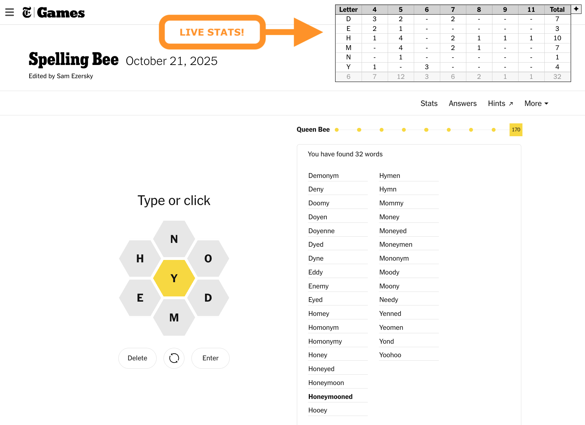
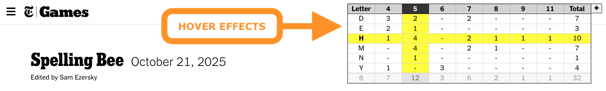
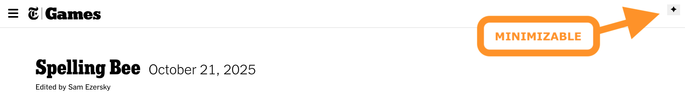

# Spelling Bee Live Word Stats

## Overview

This project provides **feature enhancements** for the [Spelling Bee](https://www.nytimes.com/puzzles/spelling-bee) puzzle game directly on the New York Times website.

It adds real-time word counts and other statistics, making it easier to track progress and enhance the Spelling Bee experience.

You will get a compact, live-updating table (letters × word lengths + totals) directly on the Spelling Bee page with a small floating menu to toggle visibility.

## Installation Instructions

There are two ways you can add this feature enhancement:

1. [Browser Extension](extension/README.md) (recommended)
1. [Tampermonkey Script](script/README.md)

## Usage

### You will automatically see real-time stats on the Spelling Bee game page.

### Try hovering over the stats to highlight a specific letter and word count!

### You can minimize the display by clicking the diamond icon in the top right corner.

## Links

- [New York Times Games](https://www.nytimes.com/games)
- [Spelling Bee](https://www.nytimes.com/puzzles/spelling-bee)
- [Tampermonkey](https://www.tampermonkey.net/)

## Contributing

This project is open source and welcomes contributions. You can contribute by reporting bugs, suggesting features, giving feedback, or writing code.

The source code is available on [GitHub](https://github.com/dnstock/nytimes-spelling-bee-live-word-stats). The project is maintained by [Dan Harcsztark](https://github.com/dnstock).

[Pull requests](https://github.com/dnstock/nytimes-spelling-bee-live-word-stats/pulls) are welcome. For major changes, please open an issue first to discuss what you would like to change.

## Support, Suggestions, Feedback, Etc.

To report bugs or if you encounter issues or have suggestions, please use the [GitHub issue tracker](https://github.com/dnstock/nytimes-spelling-bee-live-word-stats/issues).

## License

This project is freely available and licensed under the MIT License. See the [LICENSE](LICENSE) file for details.
