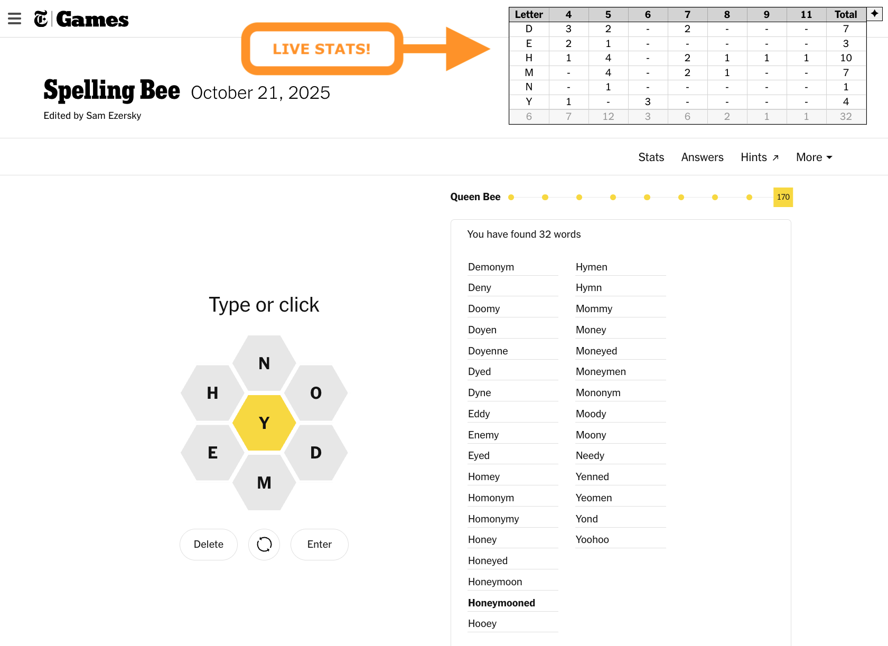
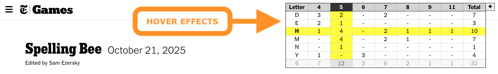
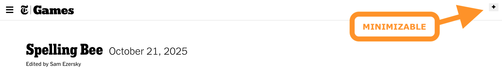

# Spelling Bee Word Stats

## Overview

This is a custom script that displays live word stats for the [Spelling Bee puzzle game](https://www.nytimes.com/puzzles/spelling-bee) directly on the New York Times website. 

It provides real-time word count and other statistics to enhance the Spelling Bee experience, making it easier to track progress and improve vocabulary skills.

## Installation

To install this script, follow these steps:

1. Install the Tampermonkey Chrome extension by visiting [tampermonkey.net](https://www.tampermonkey.net/).
2. Once Tampermonkey is installed, click the Tampermonkey icon in your browser's toolbar.
3. Select "Create New Script" and paste the script code into the editor.
4. Save the script and reload the Spelling Bee game page to see the live word stats.
5. Enjoy enhanced gameplay with real-time statistics!

## Usage

### After installation, the script will automatically display word stats on the Spelling Bee game page!

### Try hovering over the stats to highlight a specific letter and word count!

### You can minimize the display by clicking the diamond icon in the top right corner.

## Support

If you encounter any issues or have suggestions for improvement, please feel free to open an [issue](https://github.com/dnstock/nytimes-spelling-bee-word-stats/issues) or submit a [pull request](https://github.com/dnstock/nytimes-spelling-bee-word-stats/pulls) on GitHub.

## Links

- [New York Times Games](https://www.nytimes.com/games)
- [Spelling Bee](https://www.nytimes.com/puzzles/spelling-bee)
- [Tampermonkey](https://www.tampermonkey.net/)

## License

This project is freely licensed under the MIT License - see the [LICENSE](LICENSE) file for details.
